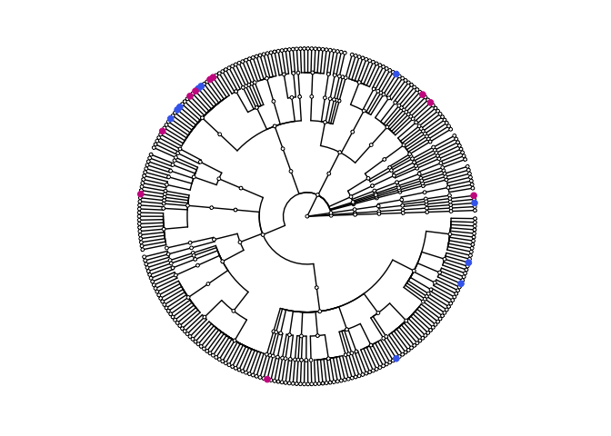
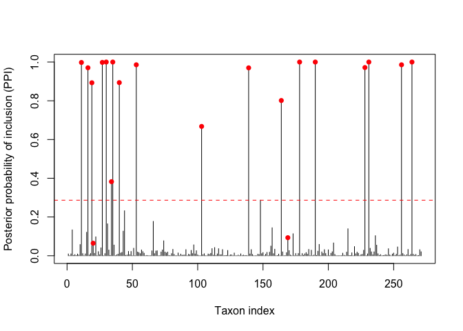

# BMDA

## Bayesian Modeling of Metagenomic Sequencing Data for Discovering Microbial Biomarkers in Colorectal Cancer Detection

## Introduction

The following script is a tutorial for performing differential abundance
analysis for microbiome count data using the proposed Zero-inflated
Negative Binomial model with the Dirichlet Process Prior (ZINB-DPP) for
data normalization in the manuscript Q.Li *et al. 2019*
<https://arxiv.org/abs/1902.08741>.

## Contents

  - [Data Generation](#data-generation)
      - [Taxonomic tree structure](#taxonomic-tree-structure)
      - [Count simulation](#count-simulation)
  - [Model Fitting](#model-fitting)
  - [Evaluation](#evaluation)
  - [Citation](#citation)
  - [Contact](#contact)

## Data Generation

To mimic the real microbiome data that contains taxa from different
taxonomic levels, we simulate the data following the tree structure of
the real data analyzed in the paper. The tree contains 492 taxa from
species to kingdom levels.

#### Taxonomic tree structure

We first load the real taxonomic tree information for data simulation.
Suppose we have 
discriminating species as highlighted by the colored dots in the
cladogram shown below.

``` r
source("user_functions.R")
load("data/simulation_realtree.Rdata")

# print the names of the discriminating species 
print(da_taxa_mild)
```

    ##  [1] "s__Bacteroides_dorei"            "s__Bacteroides_cellulosilyticus"
    ##  [3] "s__Bacteroides_plebeius"         "s__Bacteroides_vulgatus"        
    ##  [5] "s__Bacteroides_sp_2_1_22"        "s__Bacteroides_clarus"          
    ##  [7] "s__Bacteroides_ovatus"           "s__Bacteroides_fragilis"        
    ##  [9] "s__Bacteroides_faecis"           "s__Bacteroides_eggerthii"       
    ## [11] "s__Enterorhabdus_caecimuris"     "s__Methanosphaera_stadtmanae"   
    ## [13] "s__Porcine_type_C_oncovirus"     "s__Coprobacillus_sp_29_1"       
    ## [15] "s__Ruminococcus_obeum"           "s__Butyricicoccus_pullicaecorum"
    ## [17] "s__Clostridium_bartlettii"       "s__Coprococcus_comes"           
    ## [19] "s__Adlercreutzia_equolifaciens"  "s__Alloscardovia_omnicolens"

``` r
# randomly set the direction of enrichment (direction_t) of these discriminating species 
set.seed(20201201)
direction_t = rep(1, 20)
neg_idx = sample(x = seq(1, 20), size = round(0.5*20) )
direction_t[neg_idx] = -1

# check the cladogram 
tree.check(controln = da_taxa_mild[direction_t == -1],
           casen = da_taxa_mild[direction_t == 1],
           hl_size = 2)
```

<!-- -->

Here, the two different colors used for the discriminating species
indicate the enrichment direction. The pink dots are species that are
more abundant in group 1, while the blue dots are species enriched in
group 2.

#### Count simulation

Based on the tree structure above, we generate the count table by
assuming there are  subjects with equal group sizes. The function `gen_zinb_raw` and
`gen_zinb_info` generate the data from a ZINB distribution

``` r
# set group size 
n_group = 20
# set the phenotype information
group_index = rep(c(0,1), each = n_group)
# set the number of discriminating and nondiscriminating species 
p_diff = 20; p_nondiff = length(taxa_name) - 20
temp_file = gen_zinb_raw(zt = group_index, p_diff = 20, 
                       p_remain = p_nondiff, 
                       direction_t = direction_t,
                       seed = 1234, 
                       low = 1, high = 2)
temp_dat = gen_zinb_info(da_taxa_mild, taxa_name, info_list = temp_file)
```

Next, we get the adjacent matrix based on the taxonomic tree structure

``` r
G_mat = S2adj(Y = temp_dat$Y, S = S_mat)
```

## Model Fitting

Next, we fit the ZINB-DPP model based on the default setting:

``` r
library(Rcpp)
sourceCpp("core_zinb_x5.cpp")

# model input & initial settings
Ymat = temp_dat$Y
n_sample = n_group * 2
s_ini = rep(1, n_sample)
Niter = 10000

# MCMC 
model_fit = zinb_model_estimator(Y = Ymat, z = group_index, s = s_ini, 
                                 iter = Niter, 
                                 DPP = TRUE, 
                                 S = S_mat, 
                                 aggregate = TRUE, 
                                 store = TRUE,
                                 MRF = TRUE, 
                                 G = G_mat)
```

    ## 0% has been done
    ## 10% has been done
    ## 20% has been done
    ## 30% has been done
    ## 40% has been done
    ## 50% has been done
    ## 60% has been done
    ## 70% has been done
    ## 80% has been done
    ## 90% has been done

## Evaluation

Now, we evaluate our model by visualizing the result of the
discriminating species detection.

``` r
# get the species level result
p_bottom = ncol(Ymat)
specis_idx = model_fit$flag[1:p_bottom]
gamma_bottom = model_fit[["gamma_ppi"]][1:p_bottom]
gamma_bottom = gamma_bottom[specis_idx == 0]

# truly discrimintating species
gamma_true = temp_dat$gamma_true
gamma_true = gamma_true[specis_idx == 0]
DA_true = which(gamma_true == 1)
DA_gamma = gamma_bottom[DA_true]

# detect discrimintating species by controlling the Bayesian false discovery rate 
cut_off = BayFDR(model_fit[["gamma_ppi"]][model_fit$flag == 0], 0.05)
DA_idx = which(gamma_bottom > cut_off)
plot(gamma_bottom, type = 'h', 
     ylim = c(0, 1), ylab = "Posterior probability of inclusion (PPI)", xlab = "Taxon index")
abline(h = cut_off, col = 'red',lty = 2)
points(x = DA_true , y = DA_gamma, pch = 16, col = 'red')
```

<!-- --> Each vertial line
is the posterior proability of inclusion (PPI) of a species. The dashed
line represents the threshold that controls the Bayesian false discovery
rate to be less than . The species whose PPIs exceed the dashed line would be selected
to be differentially abundant.

Notice that the red dots are true discriminating taxa. According to the
model fitting, we have

  - Number of true positive = 18

  - Number of false positive = 0

  - Number of true negative = 251

  - Number of false negative = 2

## Citation

Qiwei Li, Shuang Jiang, Guanghua Xiao, Andrew Y. Koh, Xiaowei Zhan
(2019), Bayesian Modeling of Microbiome Data for Differential Abundance
Analysis, arXiv:1902.08741.

## Contact

Qiwei Li, Department of Mathematical Science, The University of Texas at
Dallas, Richardson, Texas <liqiwei2000@gmail.com>
